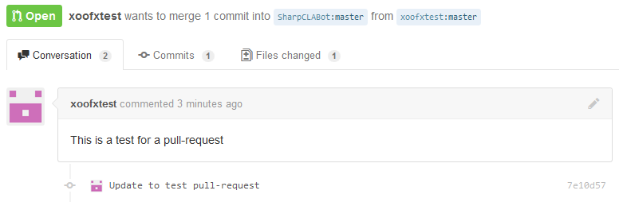
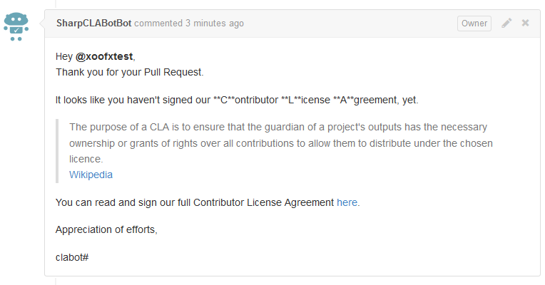
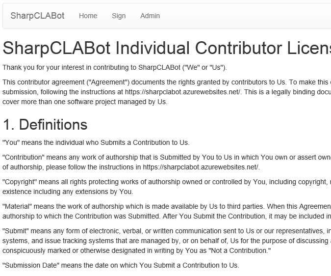
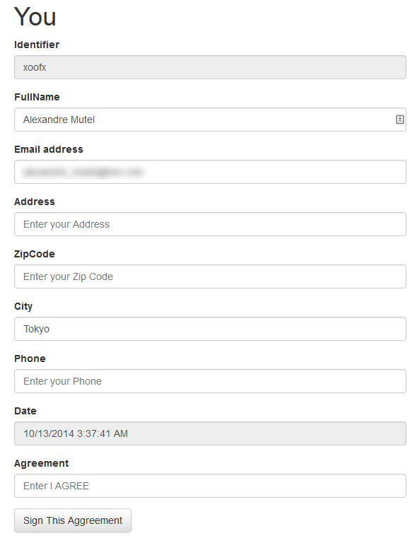
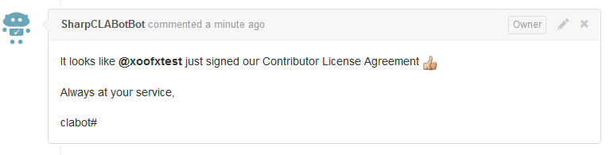

# SharpCLABot

SharpCLABot is a robot running on the **ASP.net platform** that will help you to:

- **Check Pull Requests** submitted to your github repository. 
- Redirect new contributors to an **online electronic form** to sign the **Contributor License Agreement** of your project.

### Features

- Fully integrated with github. 
- Receive pull-request events, auto-comment on pull-request
- Use github contributor identity via OAuth to verify before signing
- Easy step-by-step configuration online
- Administrator configuration panel
 - Customize templates for the bot comment replies
 - Customize templates for the *Individual CLA* and *Information about Us*  
- Compatible with Microsoft Azure platform

### Requirements

- An ASP.net web server (supporting .NET 4.5+)
- A small database deployed with the web site (Default is using LocalDb. Note: that LocalDb is not working on Azure and you need to provide your own connection string during SharpCLABot setup) 

## What is a CLA?

> The purpose of a CLA is to ensure that the guardian of a project's outputs has the necessary ownership or grants of rights over all contributions to allow them to distribute under the chosen licence.
> [Wikipedia](http://en.wikipedia.org/wiki/Contributor_License_Agreement)

## How is it working?

### A new contributor... 
A new contributor is opening a pull-request on your repository that is being watched by SharpCLABot:

> 

### SharpCLABot replies...
SharpCLABot is replying that this contributor has not yet signed the CLA for the project, and invite the contributor to sign it:

> 

### The contributor signs...
The contributor go to the signing website provided by SharpCLABot and fill-out the form to sign the CLA:

> 
> 
> ~~~~~~~~~~~~~~~~~~~~~~~~~~~~~~~~~~~~~~~~~~~~~~~~~~~~~~~~~~~~~~~~~~~~~~
> 
> 

### The contributor has signed...
The contributor has just signed the CLA and is redirected to its pull request with a comment acknowledge from SharpCLABot:

> 

## How to install it?

Deploy this project to a website supporting ASP.net with .NET4.5+.

On the first connection, SharpCLABot will guide you to setup your online electronic form.

Check the [Setup](Setup.md) page for more details.

## License
SharpCLABot is released under the [Simplied BSD License](http://opensource.org/licenses/BSD-2-Clause).

## Author

SharpCLABot is developed by [Alexandre Mutel](https://github.com/xoofx) - [@xoofx](http://twitter.com/xoofx)

## Credits

SharpCLABot is using the following frameworks:

Javascript:

- [bootstrap](http://getbootstrap.com/)
- [jquery](http://jquery.com/)
- [CodeMirror](http://codemirror.net/)

.NET:

- [ASP.net](http://www.asp.net/)
- [Entity Framework](http://msdn.microsoft.com/en-us/data/ef.aspx)
- [Octokit.net](https://github.com/octokit/octokit.net)
- [DotLiquid](https://github.com/formosatek/dotliquid)
- [JSON.net](http://james.newtonking.com/json)

This project was inspired by the [clabot](https://github.com/clabot/clabot) project.

The logo "Robot" designed by [Ahmed Elzahra](http://www.thenounproject.com/trochilidae) from the [Noun Project](http://www.thenounproject.com) released under the [Creative Commons – Attribution (CC BY 3.0)](http://creativecommons.org/licenses/by/3.0/us/).
