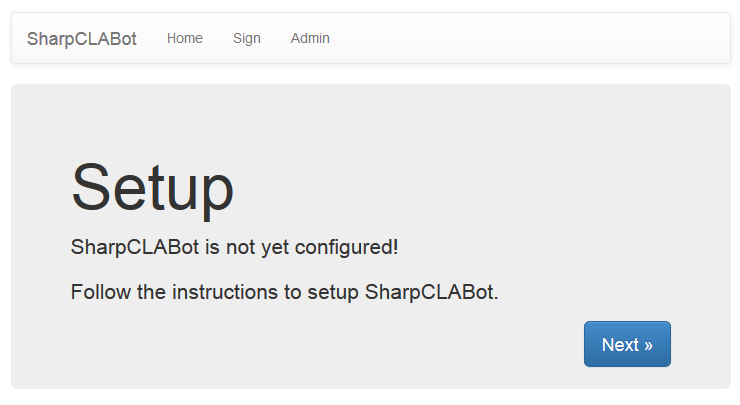
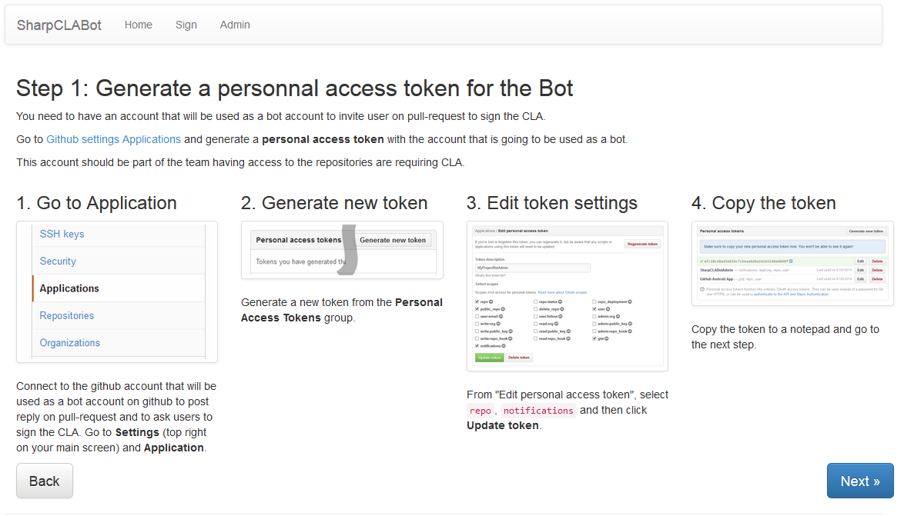
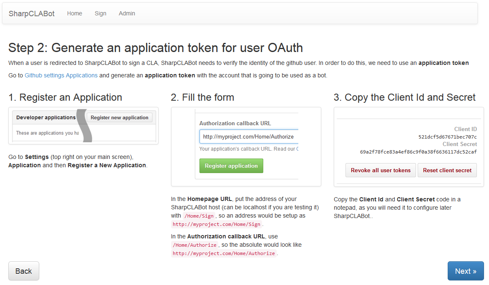
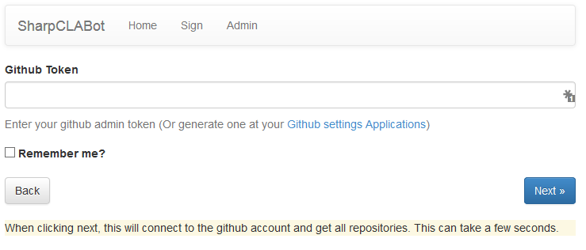
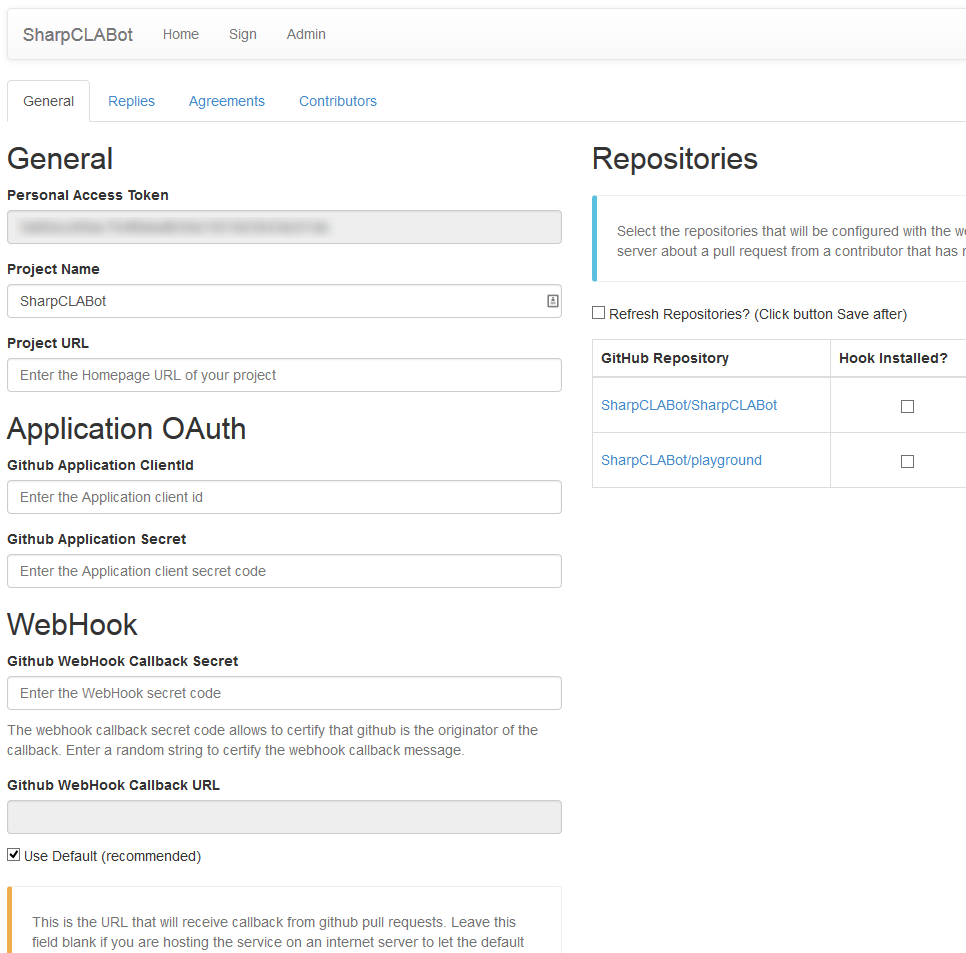
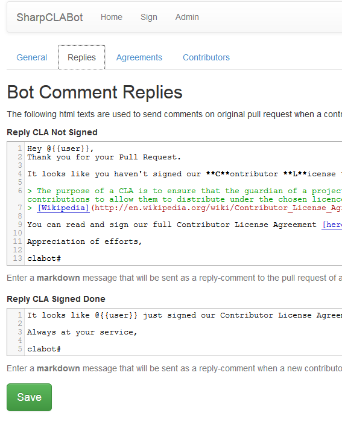
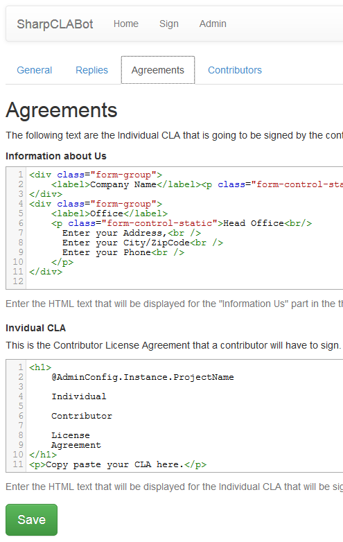

# SharpCLABot Setup

SharpCLABot configuration provides a full HTML admin config panel integrated with the server. No need to modify any files manually on your website.

## 1. Deploy SharpCLABot

Simply deploy/copy SharpCLABot to an ASP.net web server. 

Prefer to use a server with **https** address in order to encrypt all communications to your server.

## 2. Setup

Then go to the address of your SharpCLABot server `https://myclabotserver.com` and start following configuration steps:

### 2.1 Welcome Setup Page

> 

### 2.2 Create a Personal Access Token

> 

 
### 2.3 Create an Application Client token

> 

 
### 2.4 Register your Personal Accses Token

> 

 
Once you have entered your Personal Access Token, you will be able to configure SharpCLABot.

### 3. Admin Configuration

### 3.1 Main Tab

On this tab, you have to configure:

- the tokens generated previously
- the secret phrase used by the webhook callback (to authenticate the communication with github)
- the database connection string
- the repositories that will be watched by your SharpCLABot server 

> 

### 3.2 Replies Tab

On this tab, you can change the replies (**markdown** templates) used by the bot to respond on a pull request.

>  

### 3.3 Agreement Tab

On this tab, you can change the information about your project and the CLA that will be signed by contributors of your project (They are **html** templates)

>  

### 3.4 Contributors Tab

On this tab, you can verify the list of contributors that have signed the CLA of your projects.